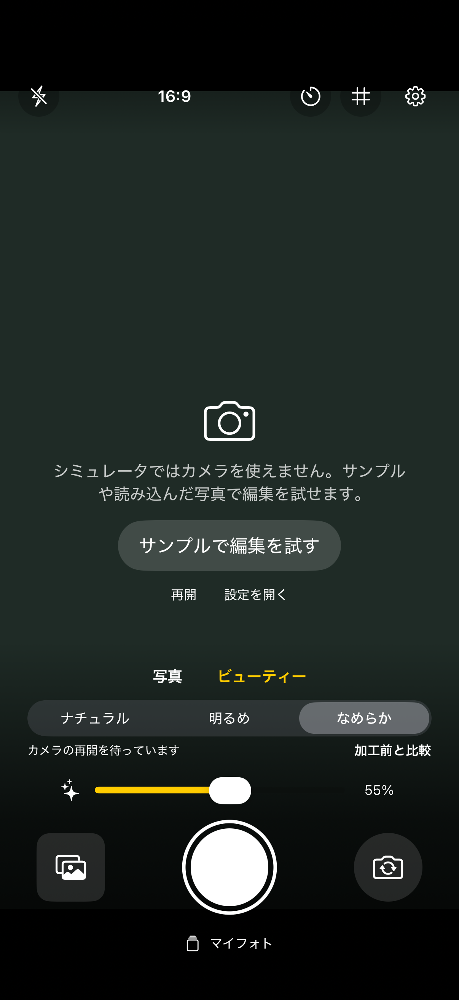
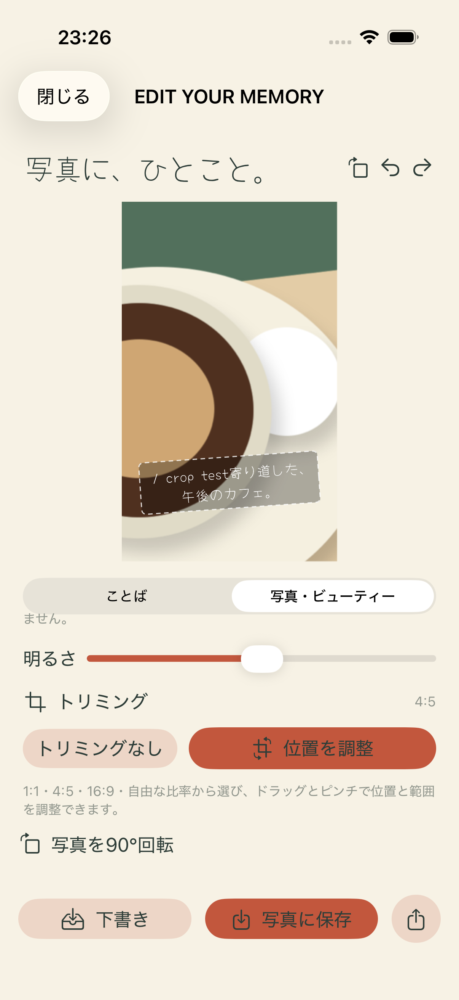

# 開発版の検証結果

実施日：2026-09-08（日本時間）
環境：Xcode 26.6、iOS 26.5 / iPhone 17 Proシミュレータ

- シミュレータ向けビルド：成功
- 実機向け（generic iOS、署名なし）ビルド：成功
- 単体テスト：7件成功、失敗0
- UIテスト：1件成功、失敗0

UIテストではサンプル画像を開き、文字の追加入力、下書き保存、マイフォトからの再編集、写真追加権限の許可、写真アプリへの保存完了まで確認しました。
保存後の画面にある `UI test` はテストで追加入力した文字列です。

初回のUIテストは入力欄をTextViewとして検索して失敗しました。実際のアクセシビリティ階層に合わせてTextFieldへ修正後、全テストが成功しています。
実機向けビルドはコンパイル検証のみで、iPhoneへのインストール・撮影は未実施です。美肌加工の実写品質・ライブ速度・発熱・高解像度写真のメモリ消費は未検証です。

ローカルの詳細結果：`build/Logs/Test/Test-PenPhoto-2026.09.08_23-54-56-+0900.xcresult`

## 実機検証の準備（2026-09-09）

- 確認対象：ペアリング済みiPhone 16e（iOS 26.6.1）、デベロッパモード有効。
- このMacの既存Apple Development証明書を利用する自動署名設定を追加。
- 実機向け署名ビルド成功。codesignによる署名検証成功。
- `scripts/run_on_device.py` に署名ビルド・インストール・起動をまとめた。
- インストールを実行したが、デバイスのロックにより開発者ディスクイメージのマウントが拒否された（kAMDMobileImageMounterDeviceLocked）。
- 2026-09-09 00:12（日本時間）、ユーザーがロックを解除した後に再実行。iPhone 16eへのインストール成功、`jp.penphoto.app` の起動成功をdevicectlで確認。
- 実写撮影、カメラ権限の許可、美肌処理の品質・速度はユーザーによる実機確認待ち。

## 16:9撮影対応（0.1.1 / Build 2、2026-09-09）

- 撮影画面の4:3／16:9切り替えと選択の永続化を追加。縦持ちは9:16、横持ちは16:9。
- 撮影比率は元写真とは別に保存し、編集・書き出し・下書き再読込に適用。旧形式の下書きも読み込める。
- 単体テスト11件、UIテスト2件が成功。縦横の書き出し寸法、プレビューとの中央範囲の一致、回転、旧データ互換性、設定の保持を確認。
- 実機向け署名ビルド成功。iPhone 16eへの更新インストール成功（00:20 JST）。端末ロックのため自動起動は拒否された。アイコンからの起動と実写による画角確認はユーザー確認待ち。
- 結果：`build/Logs/Test/Test-PenPhoto-2026.09.09_00-19-22-+0900.xcresult`

## 16:9撮影画面の全幅化（0.1.2 / Build 3、2026-09-09）

- 16:9撮影画面から左右余白・角丸・ブランドヘッダーを除去。黒背景に全幅の9:16ファインダー、白いシャッターと半透明の操作エリアを重ねる構成に変更。
- デバイス画面と撮影画像の縦横比が異なるため、上下は黒い操作エリアとして使用し、撮影画像の範囲は維持。
- 初回の操作テストで上部ボタンがセンサー領域と重なる問題を検出。外側のセーフエリアを操作パネルへ渡して修正。
- 単体テスト11件・UIテスト2件が成功。全幅、比率、読込ボタンの操作可否、比率の往復切替、設定保持、編集・保存を確認。
- 更新版をiPhone 16eへ00:28 JSTにインストール済み。直前の起動で端末ロックが確認されたため最終更新では自動起動せず、アイコンから起動できる状態にした。
- テスト結果：`build/Logs/Test/Test-PenPhoto-2026.09.09_00-28-12-+0900.xcresult`

## ビューティー加工（0.2.0 / Build 4、2026-09-09）

- ナチュラル／明るめ／なめらかの3種類、0〜100%の強度、加工前との比較、顔検出状態表示を追加。4:3／16:9撮影と撮影後の編集に対応。
- Visionの目・眉・口・鼻を保護領域にし、顔境界をぼかしたマスクと画像のエッジによる抑制を適用。ノイズ低減・弱い平滑化・明るさ補正を部分合成。顔の形状は変更しない。
- シミュレータでは既定のVision実行が顔を検出しなかったため、シミュレータのみCPU実行に設定。実顔写真テストで検出・保護領域の生成・加工差分を確認。
- 単体テスト14件が成功（`Test-PenPhoto-2026.09.09_20-16-55-+0900.xcresult`）。顔写真、強度の上限下限、保護領域、背景、旧データ互換性を検証。
- UIテスト3件成功（`Test-PenPhoto-2026.09.09_20-13-03-+0900.xcresult`のUIテスト。画像テストは上記再実行で成功）。
- テスト用写真1枚での確認であり、多様な肌色・暗所・複数人の実写品質、実機での連続使用時のフレーム速度・発熱は未検証。ライブ処理は最大12fpsを目標とし、実測保証はしていない。

加工前後の実際のテスト出力：[元画像](beauty/original.png)／[なめらか・100%](beauty/soft.png)／[明るめ・100%](beauty/clear.png)。
画像出典：NASA由来のscikit-image公開テスト画像。詳細・出典は[フィクスチャの説明](../PenPhotoTests/Fixtures/README.md)を参照。製品には同梱しない。

- 最終の表示調整後にビューティー操作テスト1件を再実行して成功（`Test-PenPhoto-2026.09.09_20-23-27-+0900.xcresult`）。
- 2026-09-09 20:19 JST、署名済み最終版をiPhone 16eへインストール成功。実機での実写評価は未実施。

## 実機検証の追加着手（2026-09-09）

- iPhone 16eを指定して実機単体テストをビルドしたが、`Unlock takumのiPhone to Continue` で実行が停止。その後テストランナーとの接続が失われ、テスト開始前に失敗した。アプリのテスト失敗・クラッシュを確認したものではない。
- 実機での顔検出・加工時間・発熱の検証は未完了。ロック解除後に再実行が必要。
- プレビュー処理の時間測定テストを追加し、シミュレータで成功。640pxの顔写真を30回処理し、中央値76.3ms、p95 90.5ms。これはMac上のシミュレータでの処理単体の数値であり、iPhoneの速度・実際のカメラfps・連続使用時の発熱を示さない。

## iPhone 16eでの自動テスト完了（2026-09-09 21:15 JST）

- ロック解除後に実機単体テスト15件がすべて成功。シミュレータ用CPU設定を使わない実機のVision処理で、公開テスト顔写真の検出・加工を確認した。
- 顔検出・加工差分・保護部位・背景保持・強度の上下限・編集情報の永続化・既存データ互換性・書き出しの縦横比を確認。実機での写真アプリへの書き出し操作はこの単体テストには含まれない。
- 640pxの顔写真をウォームアップ後30回処理：中央値7.8ms、p95 9.4ms。測定直後のthermalStateはnominal。
- カメラ入力・画面描画を除いた短時間の処理単体測定であり、実写のライブfpsや長時間使用時の発熱を保証しない。多様な照明・肌色・複数人での実写評価は未実施。
- 結果：`build-physical/Logs/Test/Test-PenPhoto-2026.09.09_21-14-53-+0900.xcresult`

## ことば画面の写真回転（0.2.1 / Build 5）

- 編集画面上部へ写真の90度回転ボタンを追加。「ことば」タブと文字入力中にも操作可能。既存の写真調整タブと回転処理を共通化。
- 写真のみを回転し、コメントの傾きと相対位置は保持。回転を取り消す／やり直す操作にも対応。
- UIテストで、文字入力中の回転→取り消し→やり直し→下書き保存→再編集時の向き・文字の保持→写真への保存を確認して成功。
- 2026-09-09 21:52 JST、iPhone 16eへ署名済み更新版をインストール成功。

## 撮影比率の切り替え改善（0.2.2 / Build 6）

- 4:3／16:9の操作画面からカメラプレビューを分離し、固定のZStackの背景に1個だけ配置。写真枠の位置・サイズをAnchorPreferenceで受け取り、比率変更時のAVCaptureVideoPreviewLayer再生成・セッション再接続をなくした。
- レイアウト更新時、向きが既に90度なら接続の回転設定を再適用しない。ビューティー画像も同じ写真枠へ重ねる。
- テスト専用起動引数とDebug条件でプレビューのインスタンス識別を有効化。3往復の比率変更で同一インスタンスが維持されることを検証する回帰テストを追加。通常起動・Releaseには識別情報を表示しない。
- 最終シミュレータUIテスト2件が成功。3往復でプレビュー識別子が変わらないこと、16:9の幅・比率、再起動後の比率保持、ビューティー操作を確認。添付スクリーンショットで全幅表示と操作配置も確認。
- 結果：`build/Logs/Test/Test-PenPhoto-2026.09.10_00-12-36-+0900.xcresult`。実機での切り替え時間の定量測定は未実施。
- 2026-09-10 00:15 JST、署名検証済みの最終版をiPhone 16eへインストール成功（自動起動なし）。

## トリミングの位置・範囲調整（0.3.0 / Build 7、2026-09-10）

- 中央固定だったトリミングを、位置とサイズを自分で選べる編集UIに拡張。1:1・4:5・16:9は写真をドラッグで移動・ピンチで拡大し、フチが動かない枠の中に収める操作。「自由」比率は写真全体を表示し、フチの四隅ハンドルで範囲を、内側のドラッグで位置を変える操作。「トリミングなし」ボタンで即座に解除できる。
- `PhotoRecipe`に`cropRect`（写真に対する正規化した位置・サイズ）を追加。`crop`比率のみが保存されていた旧下書きは`cropRect`なしとして扱われ、これまで通り中央基準でトリミングされる（後方互換）。
- クロップ枠の解決ロジックを`ImageProcessor`に一本化し、編集中のプレビューと書き出し画像が同じ計算で同じ範囲を切り出すようにした。
- 90度回転すると、トリミングの比率（1:1・4:5・16:9・自由・なし）は保持したまま、位置は回転後の写真に対して中央基準へ戻す。写真回転後もコメントが「変更後の写真に対する相対位置」を保つ既存方針と揃えたもので、比率の正確さ（例えば1:1が必ず正方形になること）を回転後も保証するための挙動。
- 取り消し・やり直し、下書き保存後の再編集でトリミング位置が保持されることを確認。
- 検証中に既存の「ことば」画面の回転機能で実バグを発見して修正した：文字入力欄にフォーカスがある状態で写真を回転すると、キーボードを閉じる際にSwiftUIがテキストフィールドの変更ハンドラーを値が変わっていないのに再度呼び出すことがあり、そのたびに取り消し履歴へ「回転後と同じ内容」のチェックポイントが積まれていた。この状態で「取り消す」を1回押しても、直前に積まれた「回転後」の履歴に戻るだけで見た目上は取り消しが効かなかった。テキストフィールドの変更ハンドラーで値が実際に変わった時だけ履歴を積むよう修正し、あわせてプレビュー描画のタスクにも二重に安全策（描画が完了した時点のキーと最新のキーを突き合わせ、一致しない結果は破棄する）を追加した。修正後、文字入力中の回転→取り消し→やり直しが正しく動作することをUIテストで確認。
- 単体テスト25件（トリミングの位置・境界・自由比率・回転との組み合わせ・旧データ互換・プレビューと書き出しの一致を含む）、UIテスト4件（サンプル編集、撮影比率、ビューティー、トリミング位置調整のドラッグ・ピンチ・取り消し・やり直し・再編集・トリミング解除を含む）がすべて成功。
- 結果：`build/Logs/Test/Test-PenPhoto-2026.09.10_23-25-42-+0900.xcresult`。
- シミュレータでの操作画面：
- 実写・多様な構図でのトリミング操作感、自由比率のハンドル操作のしやすさは実機でのユーザー確認が必要。

## App Storeでの公開（1.0、2026-09-17）

- App Storeへの申請・審査・公開が完了した。日本のApp Storeでバージョン1.0を無料配信中。iOS 17.0以上、カテゴリは写真／ビデオ、提供者はTAKU MATSUMURA。
- ストアページ：https://apps.apple.com/jp/app/penphoto/id6811245656
- 公開日：2026-09-17（日本時間）。上記はApple提供のストアメタデータ（`itunes.apple.com/lookup?id=6811245656&country=jp`）で2026-09-21に確認した。
- 米国ストアのURL（`/us/app/penphoto/id6811245656`）は404。現時点の配信地域は日本のみ。
- iPhone 16e（iPhone17,5相当、iOS 26.7、Developer Mode有効）へ署名済みDebugビルドをインストールし、起動を確認した（2026-09-24）。`scripts/run_on_device.py --device 00008140-001A042A1E68401C` を使用。`codesign --verify --deep --strict` も通過。
  - ユーザーが実機で動作確認を実施し、問題の報告はなかった。個別の確認項目ごとの記録は取っていない。
  - iPhone 16eでの自動テストは実行していない（不要と判断された）。単体テストはシミュレータとiPhone 12 miniで成功済み。
  - 注意：開発用ビルドのバンドルIDは公開版と同じ `jp.penphoto.app` のため、インストールすると端末上のApp Store版が置き換わる。公開版に戻すにはApp Storeから再インストールする。
- リポジトリの `PenPhoto/Info.plist` の`CFBundleShortVersionString`を公開版に合わせて 1.0 にした（2026-09-22）。`CFBundleVersion`（ビルド番号）は公開メタデータから判別できないため 7 のまま。次回申請時はApp Store Connectで公開済みビルド番号を確認し、それより大きい値にする必要がある。
- この記録はストアの公開状態の確認であり、公開版バイナリとこのリポジトリのコードが同一であることを検証したものではない。

## 写真の左回転を追加（2026-09-21実装、2026-09-23〜24検証）

- 右回転だけだった写真の90度回転を、左右どちらにも回せるようにした。編集画面上部に左回転ボタンを追加し、「写真・ビューティー」タブの回転操作も左右2つのボタンに変更した。
- 回転の向きの計算を`PhotoRecipe.rotate(clockwise:)`へ移し、`quarterTurns`が常に0..<4に収まるようにした（左回転は+3として扱う）。トリミング比率を保ったまま位置だけ中央へ戻す既存の挙動は両方向で共通。
- `ImageProcessor`の回転適用を負の`quarterTurns`でも破綻しないよう正規化した。
- 単体テスト4件を追加（左右回転の往復、左回転と右3回の描画一致、負の回転数の正規化、両方向でのトリミング位置リセット）。単体テストは合計29件になった。
- 実機（iPhone 12 mini、iPhone13,1）で単体テスト29件がすべて成功（2026-09-23 11:00 JST、失敗0、実行時間1.33秒）。追加した4件も個別に成功を確認した。
  - `testRotatingLeftUndoesRotatingRightAndWrapsWithoutGoingNegative`
  - `testLeftRotationRendersIdenticallyToThreeRightTurns`（左回転1回と右回転3回の描画結果がピクセル一致）
  - `testNegativeQuarterTurnsRenderLikeTheEquivalentForwardTurn`
  - `testRotatingEitherDirectionResetsCropPositionButKeepsTheRatio`
  - 結果：`build-physical/Logs/Test/Test-PenPhoto-2026.09.23_11-00-14-+0900.xcresult`
- シミュレータ（iPhone 17 Pro、iOS 26.5）で単体テスト29件・UIテスト5件が成功（2026-09-23）。
- UIテスト`testPhotoTurnsBothWaysFromTheHeaderAndThePhotoTab`を追加した。画面上部の左回転→右回転で元の向きに戻ること、左回転が取り消し・やり直しの対象になること、写真タブの左右ボタンでも同じ操作ができることを確認する。左右どちらに回ったかは枠の縦横だけでは区別できないため、向きそのものは単体テスト側で担保している。
- 既存UIテストが使う`rotatePhoto`は右回転に残したため、既存4件は変更していない。
- 実行環境の問題とその解消：
  - 2026-09-21時点ではシミュレータが使用不可だった。実行中の CoreSimulatorService が 1051.55.0 と古く、インストール済みフレームワークおよび Xcode 27.0 の要求 (1171.7.0) と食い違い、`Simulator device support disabled` で対象デバイスが見つからなかった。Xcode 27.0 更新後にサービスが入れ替わっていなかったことが原因で、2026-09-23には解消していた（macOS 26.6.2 / Xcode 27.0 / CoreSimulator 1171.7）。
  - 解消後の初回実行では、UIテスト完了後に `Unable to boot the Simulator`（`XPC error talking to SimLaunchHostService: Connection invalid`）で単体テストの起動に失敗した。`xcrun simctl shutdown all` と CoreSimulatorService の再起動後、再実行して成功した。
  - この作業ツリーに存在しなかった `Config/Signing.local.xcconfig` をローカル署名設定（DEVELOPMENT_TEAM = YY9Y6VAGJY）として復元した。Git管理対象外。
  - 当初 codesign が `errSecInternalComponent` で失敗した。ログインキーチェーンが施錠されていたためで、解錠後は署名が通った。
  - 初回の実機テストはiPhoneのロックによりテストランナーが起動せず、3時間以上停止したため中断した。ロック解除後の再実行で成功。以後は `-destination-timeout 120 -test-timeouts-enabled YES` を付けて無限待機を避けている。
