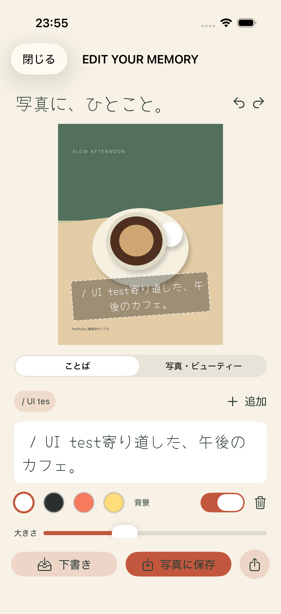
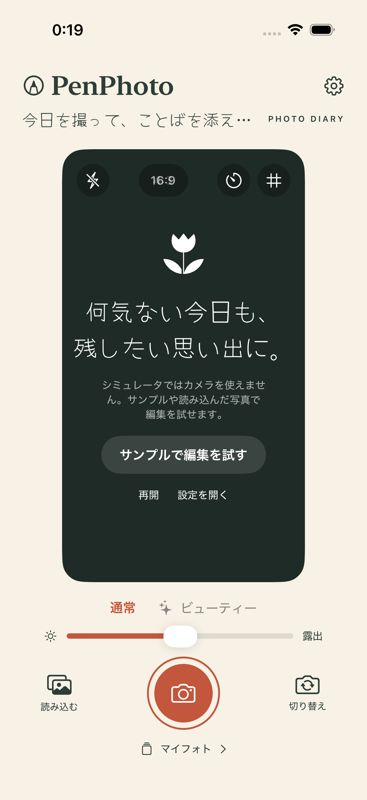
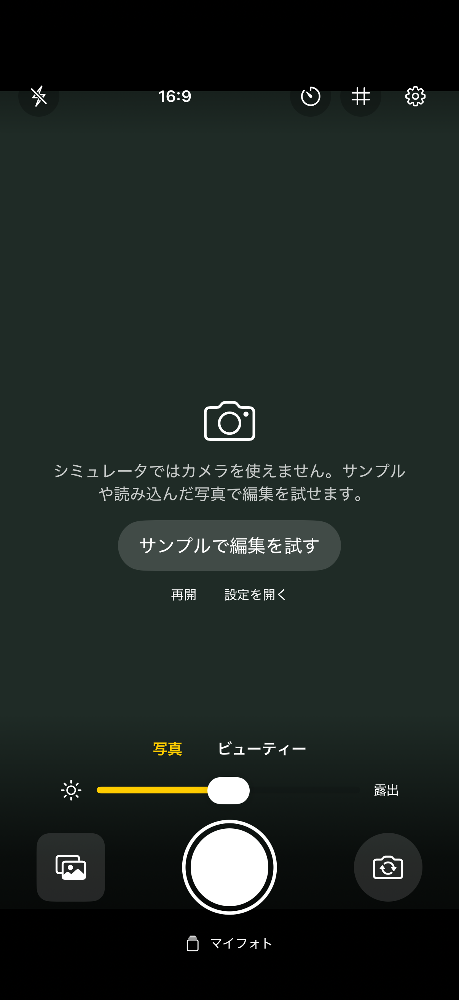

# 開発版の検証結果

実施日：2026-09-08（日本時間）
環境：Xcode 26.6、iOS 26.5 / iPhone 17 Proシミュレータ

- シミュレータ向けビルド：成功
- 実機向け（generic iOS、署名なし）ビルド：成功
- 単体テスト：7件成功、失敗0
- UIテスト：1件成功、失敗0

UIテストではサンプル画像を開き、文字の追加入力、下書き保存、マイフォトからの再編集、写真追加権限の許可、写真アプリへの保存完了まで確認しました。
保存後の画面にある `UI test` はテストで追加入力した文字列です。

初回のUIテストは入力欄をTextViewとして検索して失敗しました。実際のアクセシビリティ階層に合わせてTextFieldへ修正後、全テストが成功しています。
実機向けビルドはコンパイル検証のみで、iPhoneへのインストール・撮影は未実施です。美肌加工の実写品質・ライブ速度・発熱・高解像度写真のメモリ消費は未検証です。

ローカルの詳細結果：`build/Logs/Test/Test-PenPhoto-2026.09.08_23-54-56-+0900.xcresult`

## 実機検証の準備（2026-09-09）

- 確認対象：ペアリング済みiPhone 16e（iOS 26.6.1）、デベロッパモード有効。
- このMacの既存Apple Development証明書を利用する自動署名設定を追加。
- 実機向け署名ビルド成功。codesignによる署名検証成功。
- `scripts/run_on_device.py` に署名ビルド・インストール・起動をまとめた。
- インストールを実行したが、デバイスのロックにより開発者ディスクイメージのマウントが拒否された（kAMDMobileImageMounterDeviceLocked）。
- 2026-09-09 00:12（日本時間）、ユーザーがロックを解除した後に再実行。iPhone 16eへのインストール成功、`jp.penphoto.app` の起動成功をdevicectlで確認。
- 実写撮影、カメラ権限の許可、美肌処理の品質・速度はユーザーによる実機確認待ち。

## 16:9撮影対応（0.1.1 / Build 2、2026-09-09）

- 撮影画面の4:3／16:9切り替えと選択の永続化を追加。縦持ちは9:16、横持ちは16:9。
- 撮影比率は元写真とは別に保存し、編集・書き出し・下書き再読込に適用。旧形式の下書きも読み込める。
- 単体テスト11件、UIテスト2件が成功。縦横の書き出し寸法、プレビューとの中央範囲の一致、回転、旧データ互換性、設定の保持を確認。
- 実機向け署名ビルド成功。iPhone 16eへの更新インストール成功（00:20 JST）。端末ロックのため自動起動は拒否された。アイコンからの起動と実写による画角確認はユーザー確認待ち。
- 結果：`build/Logs/Test/Test-PenPhoto-2026.09.09_00-19-22-+0900.xcresult`

## 16:9撮影画面の全幅化（0.1.2 / Build 3、2026-09-09）

- 16:9撮影画面から左右余白・角丸・ブランドヘッダーを除去。黒背景に全幅の9:16ファインダー、白いシャッターと半透明の操作エリアを重ねる構成に変更。
- デバイス画面と撮影画像の縦横比が異なるため、上下は黒い操作エリアとして使用し、撮影画像の範囲は維持。
- 初回の操作テストで上部ボタンがセンサー領域と重なる問題を検出。外側のセーフエリアを操作パネルへ渡して修正。
- 単体テスト11件・UIテスト2件が成功。全幅、比率、読込ボタンの操作可否、比率の往復切替、設定保持、編集・保存を確認。
- 更新版をiPhone 16eへ00:28 JSTにインストール済み。直前の起動で端末ロックが確認されたため最終更新では自動起動せず、アイコンから起動できる状態にした。
- テスト結果：`build/Logs/Test/Test-PenPhoto-2026.09.09_00-28-12-+0900.xcresult`

